# IEAnalyzeR Plotting Customization

### Introduction

This vignette demonstrates the choices available in the plotting
function of IEAnalyzeR, `plot_fn_obj`.

``` r
library(IEAnalyzeR)
```

Here are the default figures plotted with the `plot_fn_obj` function on
a variety of data with no customizations. They include a single
indicator, a multi-indicator representing four regions, a
multi-indicator using monthly data, and an indicator with two categories
of indicators..

``` r
# Single Indicator
plot_fn_obj(single_data_formatted)
```


``` r

# Multi-Indicator
plot_fn_obj(multi_data_formatted)
```

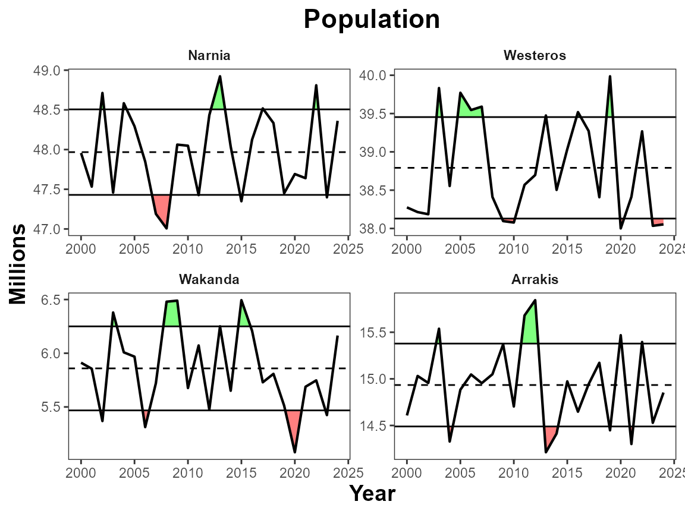

``` r

# Multi-Monthly Indicator
plot_fn_obj(monthly_data_formatted)
```


``` r

# Two category indicator
plot_fn_obj(twocat_data_formatted)
```

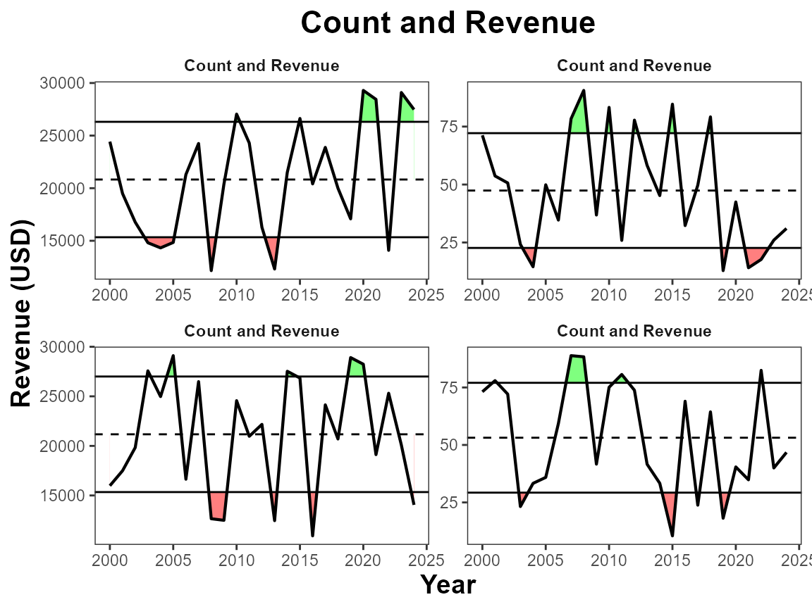

## Labels

### Manual ylab, xlab title

By default the x-axis displays as “Year”, the y-axis uses the “unit”
variable, and the title uses the “indicator” variable. You can use
`manual_xlab`, `manual_ylab`, and `manual_title` to easily customize
these features.

``` r
# Manual labels
plot_fn_obj(single_data_formatted, 
            manual_title = "Red Drum",
            manual_xlab = "Time", 
            manual_ylab = "Pounds (thousand)")
```

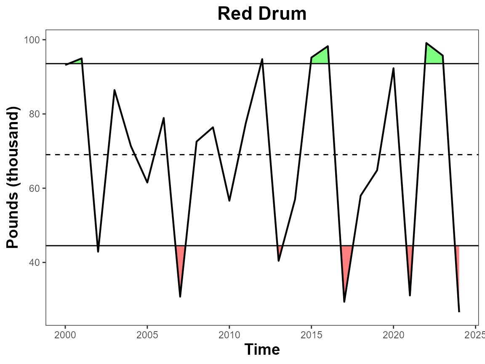

### Separate Y Labels

This argument moves the facet title to the y-axis. It is intended for
use with multi-indicators. This is a way for you to have different
y-axis labels and units.

``` r
# Move sub-panel labels to the y-axis
plot_fn_obj(multi_data_formatted, sep_ylabs = T)
```

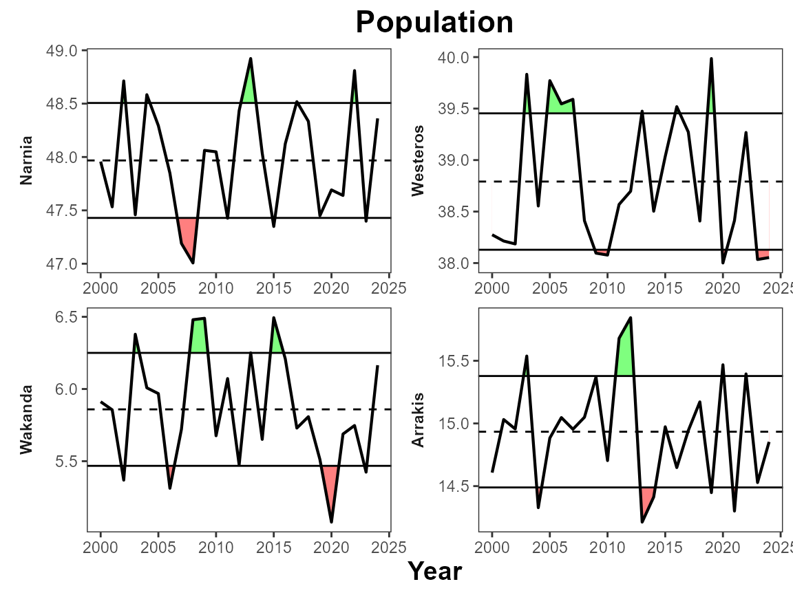

### Y lab sublabel

This argument creates a sublabel for the y-axis using the “indicator”,
“unit”, and “extent” variables. By default it uses “indicator” as the
main label and “unit” as the sublabel. You can choose which variables
are used.

``` r
# Default to Indicator & Unit
plot_fn_obj(single_data_formatted, ylab_sublabel = T)
```

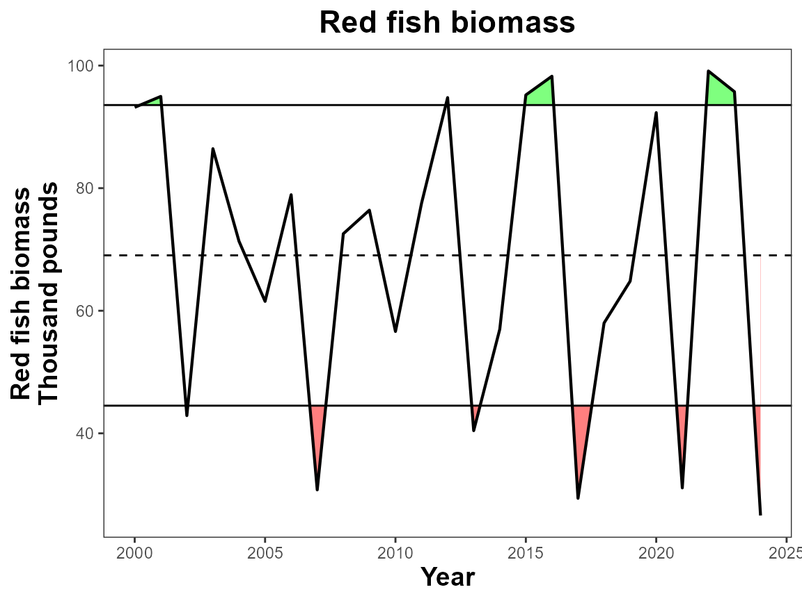

``` r

# Choose two variables to use as y-axis title and subtitle
plot_fn_obj(single_data_formatted, ylab_sublabel = c("indicator", "unit"),
            manual_title = NA)
#> Warning: `label` cannot be a <ggplot2::element_blank> object.
```

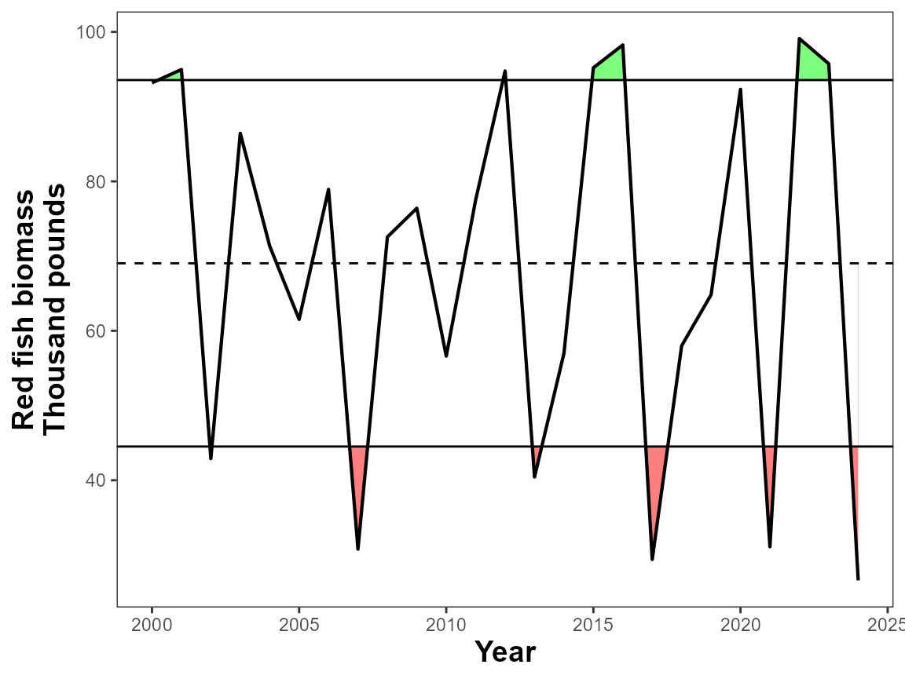

## Multi plots

### Facet Scales

The function uses facet_wrap to create multi-plots. The `facet_scales`
argument allows you to decide whether x and y axis are shared among
plots or remain the same. By default the scales are “free”, you can
choose which dimension to allow them to be free “free_x” or “free_y”, or
you can keep both the same with “fixed”.

``` r
# Fix axis scales for comparison
plot_fn_obj(multi_data_formatted, facet_scales = "fixed")
```

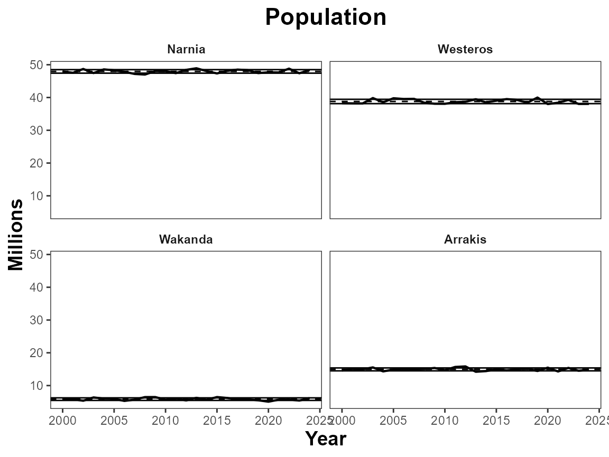

### Ncol

Use `ncol` to determine the number of columns a multi-plot figure should
contain.

``` r
# Define number of columns
plot_fn_obj(multi_data_formatted, ncol=1,
            manual_title = NA, 
            manual_ylab = "Population (millions)")
#> Warning: `label` cannot be a <ggplot2::element_blank> object.
```

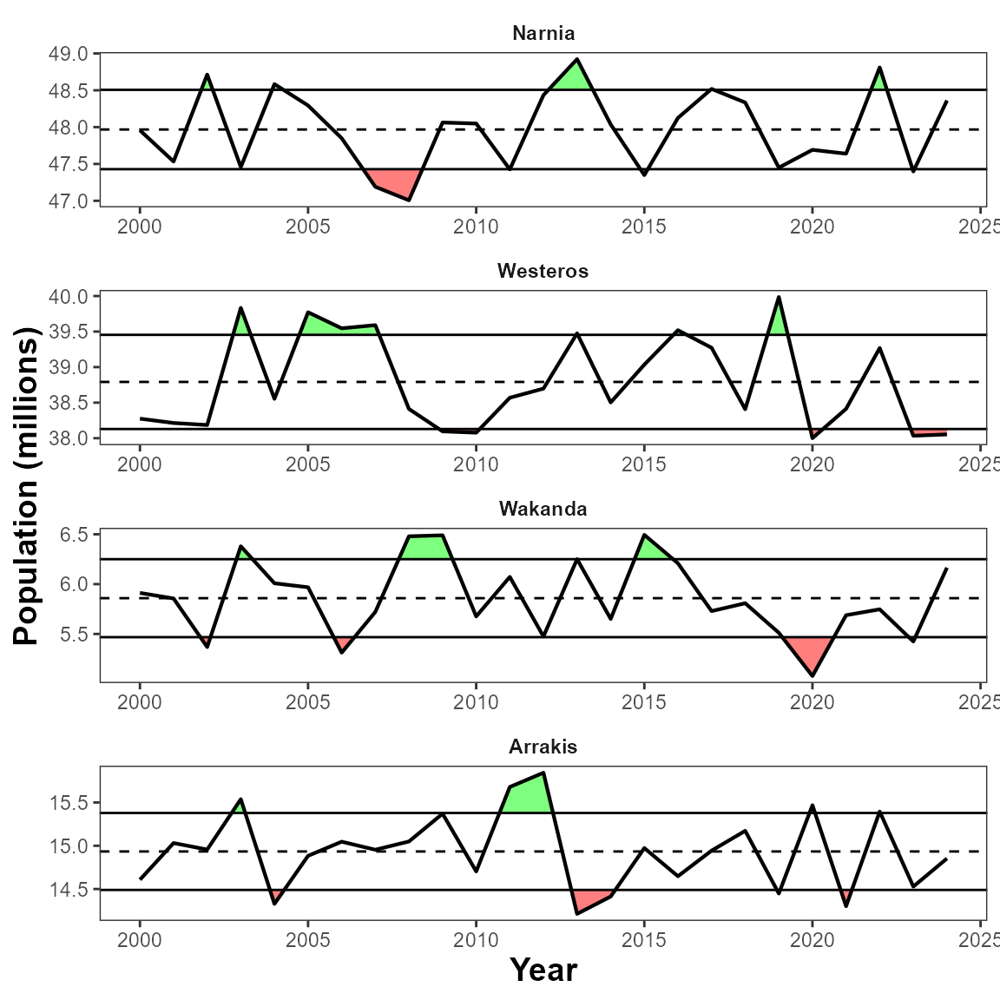

### Facet grid

This feature is useful for when you have two categories of data in your
dataset. Here we look at count and revenue for two different regions.
Using `facet_grid` to group the variables by unit and extent, allows us
to align the subpanels correctly and use the unit and the y-axis text.

``` r
plot_fn_obj(twocat_data_formatted, facet_grid = c("unit", "extent"),
            manual_ylab = NA)
```

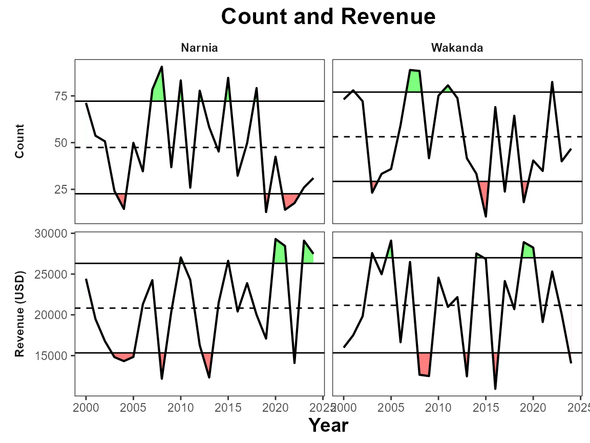

## General customization

### lwd

Use this to adjust the linewidth of the line.

``` r
# Change linewidth
plot_fn_obj(single_data_formatted, lwd = 2)
```


### pts, pt_size

Add points to the figure and adjust their size with `pt_size`

``` r
# Add points
plot_fn_obj(single_data_formatted, pts = T, pt_size = 2)
```

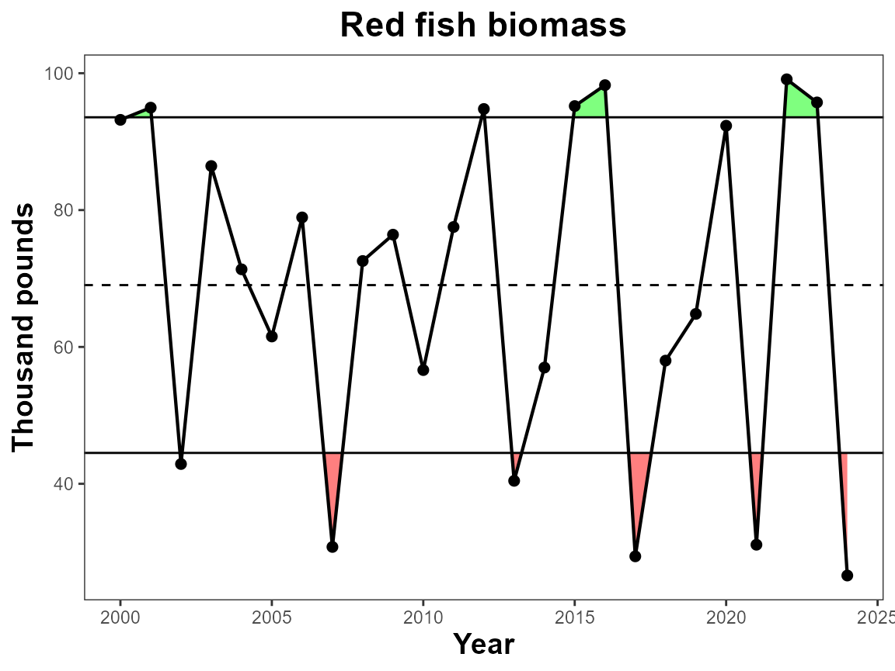

### Xbreaks by

The breaks on the x-axis naturally change based on the number of data
points in the dataset, however if you would like define the number of
years between x-axis ticks you can use `xbreaks_by`.

``` r
# Define xbreaks
plot_fn_obj(single_data_formatted, xbreaks_by = 3)
```

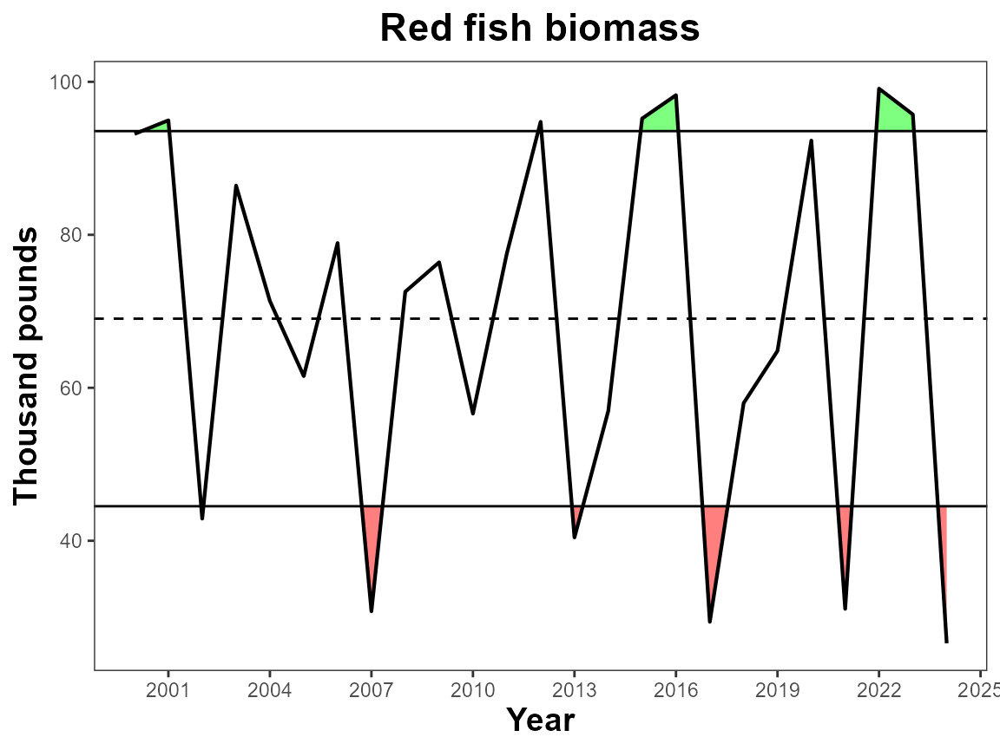

### Figure width

Figure width defines how wide the figure is in inches. Overall
dimensions can be saved when saving the figure, however when using the
trend feature, it is important to set the fig.width to the intended
saved dimensions so that the trend symbols appear in the correct place.

``` r
# Define figure width
plot_fn_obj(single_data_formatted, fig.width = 5.5)
```


## Features

### Interactive

This argument applies the ggplotly() wrapper around the produced plot
which adds interactivity to the figure. Useful for web applications.
Warning some arguments may not work correctly with this feature.

``` r
# Make interactive
plot_fn_obj(single_data_formatted, interactive = T)
```

### Trend

Add trend symbols to the plot. The trend is of the last 5 years of the
data. This will shade the selected data. See `fig.width` for making sure
the trend symbols are in the right spot for final figures.

``` r
# Add trends & define figure width
plot_fn_obj(single_data_formatted, trend = T, fig.width = 6)
```

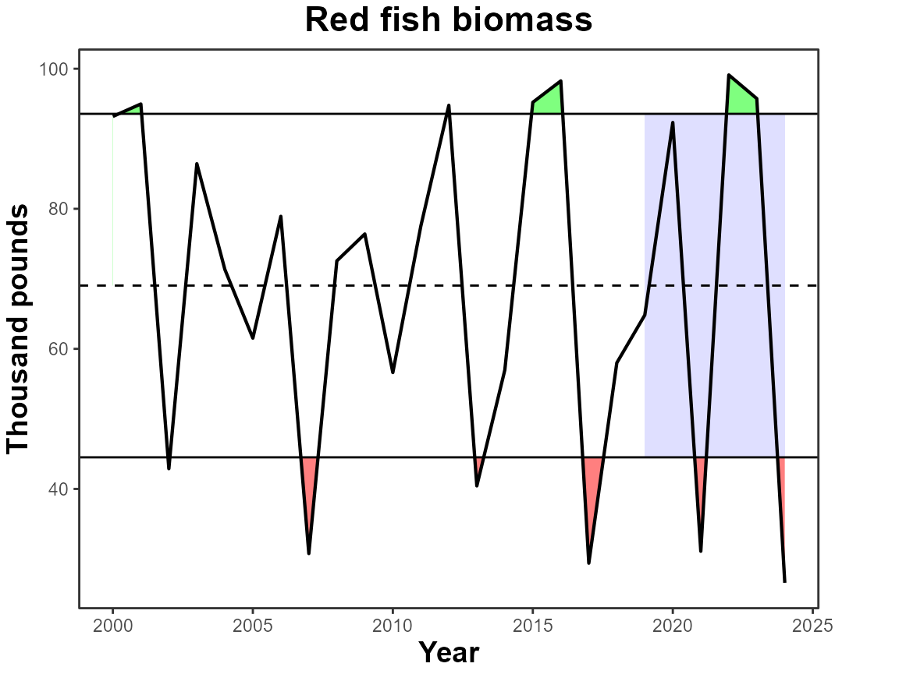

## Further Customization

The `plot_fn_obj` function creates a ggplot object, therefore if you are
familiar with the plotting mechanics of ggplot, you can add layers as
you would any other plot.

``` r
# Load ggplot2
library(ggplot2)

# Create plot with IEAnalyzeR
IEAnalyzeR_plot<-plot_fn_obj(single_data_formatted)

# Add layers using ggplot2
IEAnalyzeR_plot+
  geom_vline(aes(xintercept=2010), color="blue", lwd=1.5)+
  annotate("text", label="Stressor",
           x=2009.25, y=88,
           angle=90, size=4,
           color="blue", fontface="bold")
```

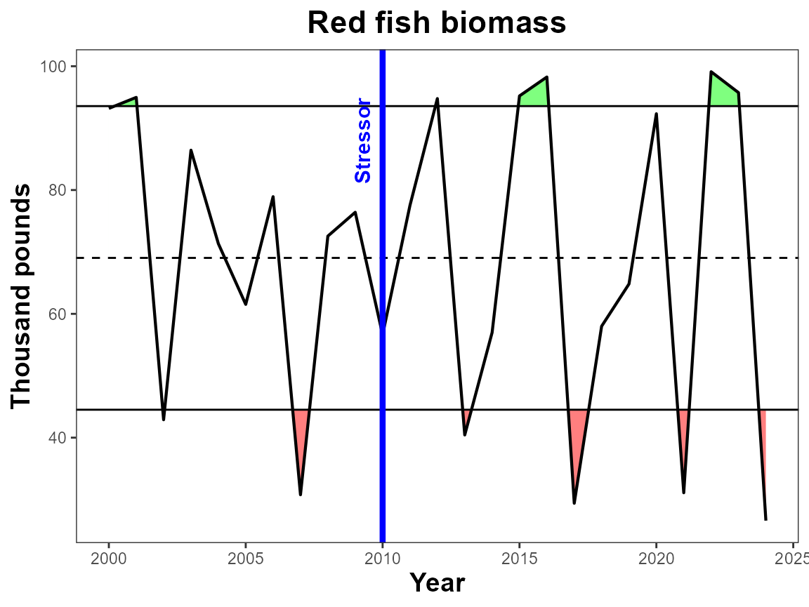
